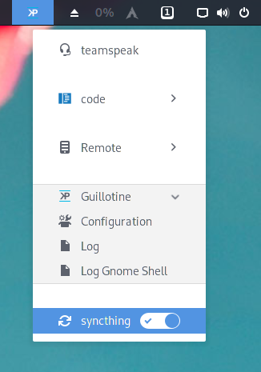

# Guillotine

Guillotine is a gnome extension designed for efficiently carrying out executions of commands from a customizable menu. Simply speaking: it is a highly customizable menu that enables you to launch commands and toggle services.



## Configuration

If no configuration is found, a default config is restored at `~/.config/guillotine.json`. Whenever the configuration file changes, the extension reloads automatically.

The configuration has two segments: `settings` and `menu`.

### Example

```
{
  "settings": {
    "icon": "start-here-symbolic.symbolic",
    "loglevel": "warning"
  },
  "menu": [
    {
      "type": "command",
      "title": "teamspeak",
      "command": "zsh -c 'pactl set-card-profile $(pactl list short | grep bluez_card | cut -f1) headset_head_unit;pactl set-default-sink $(pactl list short sinks | grep alsa_output | cut -f1);teamspeak3'",
      "icon": "audio-headset-symbolic"
    },
    {
      "type": "separator"
    },
    {
      "type": "command",
      "title": "code guillotine",
      "command": "code Projects/guillotine",
      "icon": "start-here-symbolic.symbolic",
      "killOnDisable": false
    },
    {
      "type": "command",
      "title": "code systemd.rs",
      "command": "code Projects/systemd.rs",
      "icon": "computer-fail-symbolic.symbolic",
      "killOnDisable": false
    },
    {
      "type": "separator"
    },
    {
      "type": "submenu",
      "title": "Guillotine",
      "icon": "start-here",
      "items": [
        {
          "type": "command",
          "title": "Configuration",
          "command": "xdg-open .config/guillotine.json",
          "instancing": "singleInstance",
          "icon": "preferences-other-symbolic",
          "killOnDisable": false
        },
        {
          "type": "command",
          "title": "Log",
          "command": "gnome-terminal -e 'journalctl -f GNOME_SHELL_EXTENSION_UUID=guillotine@fopdoodle.net'",
          "instancing": "singleInstance",
          "icon": "emblem-documents-symbolic"
        }
      ]
    },
    {
      "type": "separator"
    },
    {
      "type": "switch",
      "title": "syncthing",
      "start": "systemctl --user --quiet start syncthing.service",
      "stop": "systemctl --user --quiet stop syncthing.service",
      "check": "systemctl --user --quiet is-active syncthing.service",
      "icon": "emblem-synchronizing-symbolic",
      "interval": 500
    }
  ]
}
```

### Settings

- `loglevel`: (string) the log level of the extenions. any of the following values is valid:
  - `debug`
  - `info`
  - `warning` (default)
  - `error`

### Menu

The menu is an array of items, each being on of the following types.

#### 1. command

- `type`: `command`
- `title` (string): title to show
- `icon` (string): name of a system icon to show
- `command` (string): command to execute
- `instancing` (string): how to handle a running process. Either of the following values is valid:
  - `singleInstance`: the menu item is disabled until the old process finished
  - `multipleInstances` (default): no restrictions; multiple instances may be executed in parallel
  - `killBeforeRestart`: the running process is killed forcefully when the menu is selected a second time
- `killOnDisable` (boolean): whether the process gets killed when the extension gets disabled, defaults to `true`

The options `singleInstance`, `killBeforeRestart` and `killOnDisable` have no impact on background processes, i.e., these options don't work on something like `sh -c 'long-running-command &'`. Some applications are implicitly behaving like this.

#### 2. switch

- `type`: `switch`
- `title` (string): title to show
- `icon` (string): name of a system icon to show
- `start` (string): command to execute when switching from off to on
- `stop` (string): command to execute when switching from on to off
- `check` (string): command to run when checking the toggle state
- `interval` (number): time between 2 checks in miliseconds
  - defaults to 500
  - depends on `checks`
  - the interval is the length of the pause between 2 checks, i.e. if the command assigned to `check` takes 200 ms to execute and `interval` is set to 500, the command is started every 700 ms.

A switch is strictly running a single instance. You won't be able to access the menu item while the `start` or the `stop` command are executed. To be more precise: a `start` and a `stop` command will disable the menu. The next `check` command may enable the menu on success.

#### 3. submenu

- `type`: `switch`
- `title` (string): title to show
- `icon` (string): name of a system icon to show
- `items` ([]): an arry of items, see [menu](###menu)

#### 4. separator

- `type`: `separator`

### Icons

Icons can be found by searching any subdirectory of the following directories:

- ~/.local/share/icons
- /usr/share/icons

`gtk3-icon-browser` is an app that shows a selection of system icons. Personally I use glade to browse the local icons.

## Change History

- v1: 26.01.2026
  - initiale version
- v2: 29.01.2021
  - fixed a bug which prevented startup
  - implemented "submenu"
  - improved documentation
- v3: 31.01.2021
  - extension icon
  - icons for switches
  - logging adjusted: 
    - switch-check adjusted to debug
    - log level logging fixed
- v4: 01.02.2021
  - metadata fixed / prepared for v4
  - icon for extensions.gnome.org added

## ToDo

Plans. For whenever I will get bored again.

- [ ] notifications
  - [ ] on extension error
  - [ ] on command error
  - [ ] on implicit switching
- [ ] error handling
  - [ ] notifications
  - [ ] icon update

## License

Guillotine: a gnome extension designed for efficiently carrying out executions of commands from a customizable menu
Copyright (C) 2021 Christian Klaue [mail@ck76.de]

This program is free software: you can redistribute it and/or modify
it under the terms of the GNU Affero General Public License as published by
the Free Software Foundation, either version 3 of the License, or
(at your option) any later version.

This program is distributed in the hope that it will be useful,
but WITHOUT ANY WARRANTY; without even the implied warranty of
MERCHANTABILITY or FITNESS FOR A PARTICULAR PURPOSE.  See the
GNU Affero General Public License for more details.

You should have received a copy of the GNU Affero General Public License
along with this program.  If not, see <https://www.gnu.org/licenses/>.

Individual licenses may be granted upon request.
